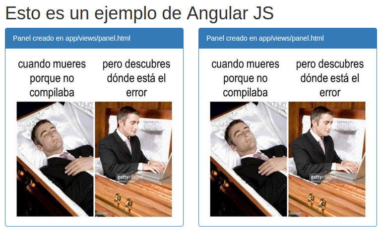

## 5 Desarrollo de Directivas

¿Que es una directiva?
 Las directivas de Angular sirven para encapsular código HTML de manera que nuestras aplicaciones puedan tener elementos reutilizables, también conocidos como componentes.

AngularJS permite definir directivas propias, estas podrán ser creadas a nivel de elemento `‘E’` o atributo `‘A’` dentro de un tag de HTML.

Las creamos en un archivo Javascript que debe ser importado como dependencia en nuestro app.js y debe contener un template de HTML (similar a lo que se hace con `ng-include`).

Ejemplo:

Crearemos dos directivas que nos permitirán crear un componente de __bootstrap.css__ `"bootstrap panel"`

Estas directivas incluirán el fragmento correspondiente de HTML como Elemento `'E'`: `<mi-panel2></mi-panel2>` y como atributo `'A'`: `<div  mi-panel1></div>`

El template del panel consistirá en el siguiente fragmento HTML:

```html
<div class="panel panel-primary">
  <div class="panel-heading">Panel creado en app/views/panel.html</div> 
  <div class="panel-body">
    
  </div>
</div>
```

El código en el archivo `directives.js` ubicado en `app/directives.js`:

```javascript
'use strict';

(function () {
  var direc = angular.module('directives-example',[]);

  direc.directive('miPanel1',function(){
    return {
      restric : 'A',
      templateUrl : 'app/views/panel.html'
      
    }
  });
  
  direc.directive('miPanel2',function(){
    return {
      restric : 'E',
      templateUrl : 'app/views/panel.html'
      
    }
  }); 
})();

```

El código en nuestro `AplicacionController.js` ubicado en `app/controllers/` es:
```javascript
'use strict';

(function () {
  var controlador = angular.module('app-controller',[]);
  controlador.controller('applicationController', ['$scope', function($scope){
    $scope.ejemplo='Esto es un ejemplo de Angular JS';
  }]);
})();
```
El código en `app.js` en la ruta `app/app.js` es:
```javascript
'use strict';

(function(){
	var app= angular.module('app',['directives-example', 'app-controller']);
})();
```

El código en nuestro `index.html` será:
```html
<!-- Archivo index.html es el archivo principal, este contiene la aplicación que desarrollaremos en angular
  además del controlador principal, esta página recibirá toda la lógica que implementemos en nuestro proyecto
  basado en esta tecnologia para el FrontEnd de nuestro sistema -->
<!DOCTYPE html>
<html lang="es">
<head>
  <meta charset="UTF-8">
  <title>Ejemplo Angular</title>
  <!-- hojas de estilo, Bootstrap 3 y una personalizada -->
  <link rel="stylesheet" href="lib/css/bootstrap.min.css">
  <link rel="stylesheet" href="lib/css/main.css">
  <!-- Archivos Javascript -->
  <script src="lib/js/bootstrap.min.js"></script>
  <script src="lib/js/angular.min.js"></script>
  <script src="app/directives.js"></script>
  <script src="app/controllers/AplicacionController.js"></script>
  <script src="app/app.js"></script>
</head>
<body ng-app="app" ng-controller="applicationController">
  <div class="container">
    <h1 ng-bind="ejemplo"></h1>

    <div class="row">
      <div class="col-lg-4">
        <div mi-panel1></div>
      </div>
      <div class="col-lg-4">
        <mi-panel2></mi-panel2>
      </div>
    </div>
  </div> 
</body>
</html>
```
####Resultado
Los paneles resultantes fueron:

donde el panel de la izquierda es llamado como atributo y el de la derecha como elemento.