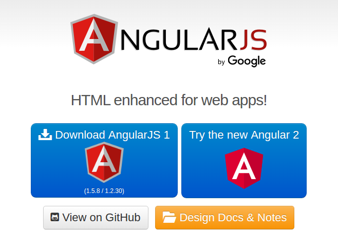

## 1. Primeros Pasos:
### 1.1­ Descargar AngularJS :
Descargar AngularJS desde el siguiente Link [https://angularjs.org/](https://angularjs.org/) y descargar Angular JS 1.5.x en su versión minima

   

