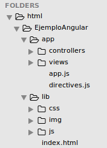

## 7. Estructura del proyecto y IIFE

###Estructura del proyecto (Frontend):

Si bien hemos hablado de muchas funcionalidades que podemos desarrollar en angular, ahora, para ordenar un poco toda esta abstracción podemos separar esto en dos carpetas principales, una /app que contenga toda la lógica de nuestros controladores y directivas desarrollada por nosotros mismos y otra /lib que contenga todas las bibliotecas y distintos códigos fuentes de Frameworks a usar (Para el Frontend).

Ejemplo:

   


###IIFE (Immediately-Invoked Function Expression)

Como se puede observar en algunos de los ejemplos, la siguiente expresión es usada para declarar fragmentos de código en javascript:
```javascript
(function () {
  //código en javascript
})();
```

Esta expresión llamada IIFE, (expresión de función de invocación inmediata), es usada para declarar variables de forma estática, es decir, que estas no son visibles al mundo exterior. (Por ejemplo, acceder a las variables o funciones desde la consola del navegador)

En el caso de los ejemplos, cada definición de controladores, filtros, etc. solo será accesible para angular a través de `Angular.module`, y no hay necesidad de exponer los módulos fuera de ese contexto.

Además del encapsulamiento de las propiedades en JavaScript, esta expresión permite evitar (imposibilita) la definición de __variables globales__, que además de ser un __muy mal estilo de programación__ emplearlas, son una gran fuente de errores de difícil seguimiento y que dificultan la modularización del código (aumentando el acoplamiento o dependencia entre los componentes).
